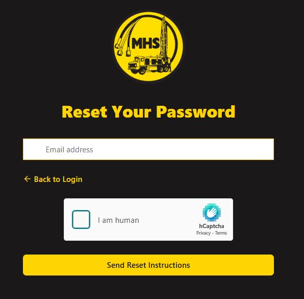

Login and Account Access
========================

This guide will help you access your MHS Partner Portal account for the first time and troubleshoot common login issues.

Accessing the Portal
--------------------

.. image:: ../_static/images/Getting Started/Login Page Cropped.JPG
   :alt: MHS Partner Portal login page showing email and password fields with Sign In button
   :width: 800px
   :class: screenshot

1. **Open your web browser** and navigate to the MHS Partner Portal URL
2. **Click "Login"** or you'll be automatically redirected to the login page
3. **Enter your credentials** (provided by MHS)
4. **Click "Sign In"** to access your account

Login Credentials
-----------------

Your login credentials consist of:

- **Email address**: Your business email address registered with MHS
- **Password**: A secure password (you'll be prompted to change it on first login)

.. note::
   Login credentials are provided by MHS when your account is set up. If you haven't received your credentials, please contact customer service.

First-Time Login
-----------------

When logging in for the first time:

1. **Use the temporary password** provided by MHS
2. **You'll be prompted to change your password** to something secure
3. **Complete any required account information**
4. **Verify your company details** are correct

Password Requirements
---------------------

Your new password must:

- Be at least **8 characters long**
- Include **uppercase and lowercase letters**
- Include **at least one number**
- Include **at least one special character** (!, @, #, $, etc.)

Reset Your Password
-------------------

If you've forgotten your password:

1. **Click "Forgot Password?"** on the login page
2. **Enter your email address** associated with your account
3. **Check your email** for a password reset link
4. **Follow the instructions** in the email to create a new password
5. **Return to the login page** and sign in with your new password

.. warning::
   Password reset emails may take a few minutes to arrive. Check your spam folder if you don't see the email.

Account Security
----------------

To keep your account secure:

- **Don't share your login credentials** with others
- **Log out when finished**, especially on shared computers
- **Use a strong, unique password** for your account
- **Report any suspicious activity** to MHS immediately

Troubleshooting Login Issues
-----------------------------

**"Invalid email or password" error:**
   - Double-check your email address spelling
   - Ensure Caps Lock is not enabled
   - Try resetting your password

**"Account not found" error:**
   - Verify you're using the correct email address
   - Contact MHS to confirm your account is set up

**Page won't load:**
   - Check your internet connection
   - Try refreshing the page
   - Clear your browser cache and cookies
   - Try a different browser

.. image:: ../_static/images/Getting Started/Login Error Message.JPG
   :alt: Example of login error message showing "Invalid email or password" alert
   :width: 600px
   :class: screenshot

**Still having trouble?**
   Contact MHS customer service with:
   - Your registered email address
   - Description of the error message
   - Screenshots if helpful

Browser Compatibility
---------------------

Supported browsers:

- **Chrome** (recommended): Version 90+
- **Firefox**: Version 88+
- **Safari**: Version 14+
- **Edge**: Version 90+

.. tip::
   For the best experience, keep your browser updated to the latest version.

Mobile Access
-------------

.. image:: ../_static/images/Getting Started/Mobile Login Page.jpg
   :alt: Mobile login page showing responsive design on smartphone
   :width: 400px
   :class: screenshot mobile-screenshot

The portal is fully responsive and works on:

- **Smartphones**: iPhone, Android phones
- **Tablets**: iPad, Android tablets

Mobile features include:
- Touch-friendly interface
- QR code scanning for parts
- Full ordering capabilities
- Order tracking

Next Steps
----------

Once you've successfully logged in:

1. :doc:`first-time-setup` - Complete your account setup
2. :doc:`dashboard-overview` - Tour your dashboard
3. :doc:`../searching-parts/basic-search` - Start searching for parts
