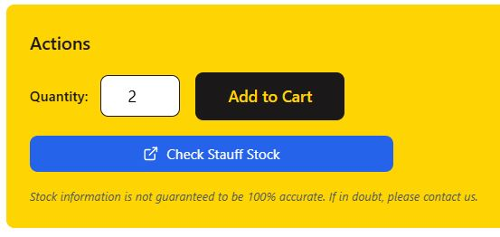
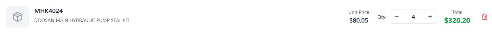
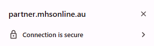

Adding Items to Cart
====================

Learn how to efficiently add parts to your cart, manage quantities, and understand the cart system in the MHS Partner Portal.

Understanding the Cart System
------------------------------

The MHS Partner Portal cart provides:
- **Persistent storage** across browser sessions
- **Real-time stock validation** during addition
- **Automatic conflict resolution** for duplicate items
- **Mobile-optimized interface** for all devices

Cart Features
-------------

**Smart Quantity Management:**
- Automatic quantity updates for duplicate parts
- Stock level warnings and suggestions
- Bulk quantity support
- Unit-aware calculations

**Cross-Session Persistence:**
- Cart contents saved automatically
- Access from any device with your account
- Survives browser restarts and logouts
- Synchronized across multiple tabs

**Stock Intelligence:**
- Real-time availability checking
- Perth warehouse vs. supplier distinction
- Backorder handling and notifications
- Alternative part suggestions

Adding Parts from Search Results
---------------------------------

From Exact Search Results
~~~~~~~~~~~~~~~~~~~~~~~~~~

1. Search for a specific part using exact part number
2. Review the part information and specifications
3. Set your desired quantity in the quantity field
4. Click "Add to Cart" button
5. Confirmation notification appears
6. Part is added to your cart immediately

.. image:: ../_static/images/adding-items-to-cart/cart-confirmation-notification-item-added-successfully.jpg
   :alt: Cart confirmation notification showing item added successfully
   :width: 600px
   :class: screenshot

From Multiple Search Results
~~~~~~~~~~~~~~~~~~~~~~~~~~~~~

.. image:: ../_static/images/cart-add-from-results-table.png
   :alt: Search results table showing multiple parts with individual Add to Cart buttons
   :width: 1000px
   :class: screenshot

*Screenshot needed: Search results table showing multiple parts, each with quantity fields and "Add to Cart" buttons, with one part highlighted as being added*

1. Perform a fuzzy or description search
2. Browse the results table to find desired parts
3. Click on a part number to view full details
4. Follow the same process as exact search
5. Return to results to add additional parts

**Quantity Considerations:**
- **Default quantity** is usually 1
- **Increase quantity** before adding to cart
- **Stock warnings** appear if quantity exceeds availability
- **Backorder notification** for insufficient stock

.. image:: ../_static/images/cart-stock-warning.png
   :alt: Stock warning message when quantity exceeds available stock
   :width: 700px
   :class: screenshot

*Screenshot needed: Warning message showing "Only 5 available in stock. Remaining 3 will be backordered" with yellow warning icon*

Adding from Different Sources
-----------------------------

From Favorites
~~~~~~~~~~~~~~

1. Access your favorites list
2. Click on a favorite part to view details
3. Set quantity and add to cart
4. Quick add functionality for frequent orders

From QR Scanning
~~~~~~~~~~~~~~~~

1. Scan a part QR code or barcode
2. Review the automatically loaded part
3. Adjust quantity if needed
4. Add directly to cart from scan results

From Order History
~~~~~~~~~~~~~~~~~~

1. View your recent orders
2. Click "Reorder" on specific items
3. Parts added with previous quantities
4. Modify quantities before final checkout

From Supplier Integration
~~~~~~~~~~~~~~~~~~~~~~~~~~

1. Use Stauff stock checking features
2. Review supplier availability and pricing
3. Add supplier items directly to cart
4. Mixed cart with local and supplier items

Cart Management
---------------

.. image:: ../_static/images/adding-items-to-cart/cart-page-showing-items.jpg
   :alt: Cart page showing all items with quantities, pricing, and total value
   :width: 1000px
   :class: screenshot

Viewing Your Cart
~~~~~~~~~~~~~~~~~

1. Click the cart icon in the navigation
2. Or use "View Cart" from dashboard quick actions
3. Review all items with quantities and pricing
4. See total order value and item count

Modifying Cart Contents
~~~~~~~~~~~~~~~~~~~~~~~~

.. image:: ../_static/images/adding-items-to-cart/quantity-cart-update-notification.jpg
   :alt: Cart items showing quantity fields being modified with real-time total updates
   :width: 900px
   :class: screenshot

Changing Quantities
^^^^^^^^^^^^^^^^^^^

1. Find the item in your cart
2. Update the quantity field
3. Changes save automatically
4. Total updates in real-time

Removing Items
^^^^^^^^^^^^^^

1. Click "Remove" next to unwanted items
2. Confirm removal if prompted
3. Item disappears immediately
4. Cart totals update automatically

.. image:: ../_static/images/cart-remove-item.png
   :alt: Cart item with Remove button highlighted and confirmation dialog
   :width: 700px
   :class: screenshot

*Screenshot needed: Cart item with "Remove" button highlighted and confirmation dialog asking "Are you sure you want to remove this item from your cart?"*

Clearing Entire Cart
^^^^^^^^^^^^^^^^^^^^

1. Click "Clear Cart" button
2. Confirm you want to remove all items
3. Cart empties completely
4. Start fresh with new selections

Understanding Cart Information
------------------------------

**Item Details Shown:**
- **Part number** and description
- **Quantity** requested
- **Unit price** specific to your account
- **Line total** (quantity × price)
- **Stock status** and availability

**Cart Totals:**
- **Subtotal** of all items
- **Number of items** in cart
- **Estimated shipping** costs (where applicable)
- **Total order value**

.. image:: ../_static/images/cart-stock-status-indicators.png
   :alt: Cart showing different stock status indicators for various items
   :width: 800px
   :class: screenshot

*Screenshot needed: Cart showing multiple items with different stock indicators: green checkmark (In Stock), yellow warning (Low Stock - 3 available), red alert (Out of Stock - Check Supplier), blue info (Supplier Item)*

**Stock Status Indicators:**
- **Green checkmark**: All items available locally
- **Yellow warning**: Partial availability or backorder
- **Red alert**: Items not available locally
- **Blue info**: Supplier items or special orders

Advanced Cart Features
----------------------

**Stock Validation:**
As you add items, the system automatically:
- **Checks current stock levels**
- **Calculates availability** for your quantities
- **Identifies potential backorders**
- **Suggests alternatives** if needed

**Backorder Handling:**
When you order more than available:
- **System accepts the full quantity**
- **Separates available** vs. backorder amounts
- **Provides clear communication** about delivery timing
- **Handles fulfillment** professionally

**Duplicate Item Resolution:**
If you add a part already in your cart:
- **Quantities are combined** automatically
- **Single line item** shows total quantity
- **Notification confirms** the combination
- **Avoids cart clutter**

**Cross-Device Synchronization:**
Your cart synchronizes across:
- **Desktop and mobile** devices
- **Different browsers** with same account
- **Multiple browser tabs**
- **After logout/login** sessions

Cart Best Practices
-------------------

**Efficient Cart Building:**
- **Add multiple items** before checking out
- **Use favorites** for frequently ordered parts
- **Review quantities** carefully before adding
- **Check stock status** for each item

**Quantity Management:**
- **Consider lead times** when setting quantities
- **Plan for future needs** with bulk ordering
- **Check minimum order** requirements
- **Account for usage rates**

**Stock Awareness:**
- **Understand Perth vs. supplier** stock
- **Plan for backorder** lead times
- **Consider alternatives** for out-of-stock items
- **Monitor stock levels** for critical parts

Mobile Cart Management
----------------------

.. image:: ../_static/images/adding-items-to-cart/mobile-cart-page.jpg
   :alt: Mobile cart interface showing touch-friendly layout with swipe actions
   :width: 400px
   :class: screenshot mobile-screenshot

**Mobile-Specific Features:**
- **Touch-friendly interface** for easy quantity changes
- **Swipe actions** for removing items
- **Optimized layout** for small screens
- **Quick add** from scanning

**Mobile Cart Tips:**
- **Double-tap** to edit quantities quickly
- **Use landscape mode** for detailed review
- **Pull down** to refresh stock status
- **Long press** for additional options

.. image:: ../_static/images/cart-mobile-quantity-edit.png
   :alt: Mobile cart showing quantity editing interface with large buttons
   :width: 400px
   :class: screenshot mobile-screenshot

*Screenshot needed: Mobile cart quantity editing showing large +/- buttons and numeric input field with touch-friendly interface*

Troubleshooting Cart Issues
---------------------------

**Items Not Adding to Cart:**
- **Check if you're logged in** properly
- **Verify part availability** in search results
- **Clear browser cache** and try again
- **Try different browser** if issues persist

**Quantities Resetting:**
- **Browser cache issues** - clear and retry
- **Session timeout** - log back in
- **Stock changes** - quantities may adjust automatically
- **System maintenance** - try again later

**Cart Not Syncing:**
- **Check internet connection**
- **Refresh the page** manually
- **Log out and back in**
- **Contact support** if problems continue

**Stock Status Confusion:**
- **Refresh the cart** for current stock levels
- **Review stock explanations** in help sections
- **Contact MHS** for specific part availability
- **Consider alternatives** if stock is uncertain

Cart Security
-------------

**Data Protection:**
- **Cart contents encrypted** during transmission
- **Secure storage** on MHS servers
- **Personal to your account** only
- **Regular security updates**

**Privacy Considerations:**
- **Cart contents private** to your account
- **Not shared** with other users
- **Automatically cleared** after extended inactivity
- **Can be manually cleared** at any time

Next Steps
----------

Once your cart is ready:

1. :doc:`understanding-stock` - Learn about stock levels and sources
2. :doc:`checkout-process` - Complete your order
3. :doc:`order-tracking` - Track your order progress
4. :doc:`../account-management/favorites` - Save frequently ordered parts
