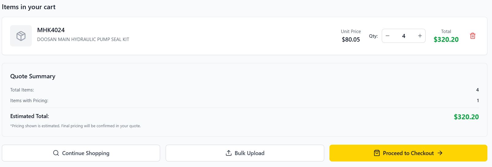
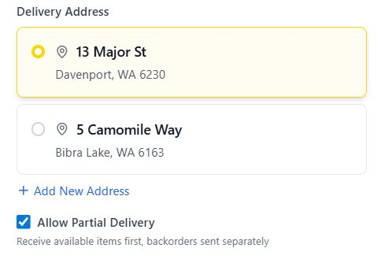
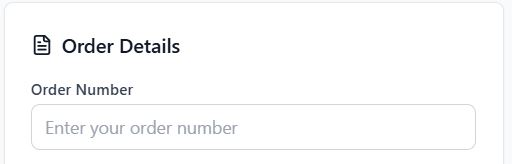

Checkout Process
================

Learn how to complete your orders professionally through the MHS Partner Portal's comprehensive checkout system.

Checkout Overview
-----------------

The checkout process includes:
- **Final cart review** and validation
- **Delivery address** selection and confirmation
- **Purchase order** reference management
- **Order approval** workflow (where required)
- **Professional email** confirmations

Starting the Checkout Process
-----------------------------

**From Your Cart:**
1. **Review your cart contents** thoroughly
2. **Verify quantities** and part numbers
3. **Check stock status** for all items
4. **Click "Proceed to Checkout"** when ready

**Pre-Checkout Validation:**
The system automatically:
- **Validates current stock** levels
- **Calculates final pricing** based on your account
- **Identifies any backorder** situations
- **Checks for approval** requirements

Checkout Steps
--------------

.. image:: ../_static/images/checkout-step1-review.png
   :alt: Checkout step 1 showing order review with cart summary and stock validation
   :width: 1000px
   :class: screenshot

*Screenshot needed: Checkout step 1 page showing "Order Review" header, complete cart summary with items, quantities, prices, stock status indicators, and options to modify quantities or remove items*

**Step 1: Order Review**

**Cart Summary:**
- Complete list of all items
- Quantities and unit prices
- Line totals and order subtotal
- Stock status for each item

**Stock Validation:**
- Real-time stock checking
- Separation of available vs. backorder items
- Clear communication about delivery timelines
- Alternative suggestions for out-of-stock items

**Item Management:**
- Final opportunity to modify quantities
- Remove unwanted items
- Add additional items if needed

**Step 2: Delivery Information**

**Delivery Address Selection:**
1. **Choose from saved addresses** in your account
2. **Or enter a new delivery address**
3. **Verify address details** are complete and accurate
4. **Add special delivery instructions** if needed

**Address Requirements:**
- Complete street address
- City, state, and postal code
- Contact person and phone number
- Any access restrictions or special instructions

**Delivery Options:**
- Standard delivery (most common)
- Express delivery (where available)
- Customer pickup (Perth warehouse)
- Special delivery arrangements

**Step 3: Order Details**

.. image:: ../_static/images/checkout-process/order-instructions.jpg
   :alt: Checkout step 3 showing purchase order reference fields and order notes
   :width: 1000px
   :class: screenshot

**Purchase Order Reference:**
- **Add your PO number** for invoice matching
- **Include project codes** or cost center information
- **Add any special references** required by your organization

**Order Notes:**
- **Special instructions** for processing
- **Urgency indicators** for critical items
- **Technical requirements** or specifications
- **Installation or delivery timing** requests

**Step 4: Final Confirmation**

.. image:: ../_static/images/checkout-process/order-summary.jpg
   :alt: Checkout step 4 showing final order summary and Place Order button
   :width: 1000px
   :class: screenshot

**Order Summary Review:**
- **Complete item list** with final quantities
- **Total order value** including all charges
- **Delivery timeline** estimates
- **Approval requirements** if applicable

**Terms and Conditions:**
- **Review terms** of sale
- **Understand delivery** commitments
- **Acknowledge backorder** handling procedures

**Final Submission:**
- **Click "Place Order"** to submit
- **Order confirmation** appears immediately
- **Email confirmations** sent automatically

Understanding Backorder Handling
---------------------------------

.. image:: ../_static/images/checkout-backorder-handling.png
   :alt: Checkout page showing mixed stock order with available and backorder items separated
   :width: 1000px
   :class: screenshot

*Screenshot needed: Checkout page showing order with both available items (green checkmarks) and backorder items (yellow warning icons), with clear sections separating immediate shipping vs. backorder items*

**Mixed Stock Orders:**
When your order contains both available and backorder items:

**Available Items:**
- ✅ Ship immediately from Perth warehouse
- Standard processing and delivery times
- Included in initial shipment

**Backorder Items:**
- 📦 Automatically ordered from suppliers
- Highlighted in yellow in confirmation emails
- Separate delivery timeline
- Professional supplier coordination

**Email Communication:**
You'll receive detailed emails showing:
- **"Items Shipping Immediately"** section
- **"Backorder Items"** section (if applicable)
- **Clear delivery timelines** for each group
- **Professional presentation** for record keeping

.. image:: ../_static/images/checkout-backorder-email.png
   :alt: Sample order confirmation email showing separated available and backorder items
   :width: 800px
   :class: screenshot

*Screenshot needed: Sample order confirmation email showing "Items Shipping Immediately" section with green items and "Backorder Items" section with yellow items, including delivery timelines for each*

**Automatic Tracking:**
- Backorder items automatically tracked
- Google Sheets integration for MHS staff
- Proactive communication on delays
- Fulfillment coordination

Order Approval Workflow
------------------------

.. image:: ../_static/images/checkout-approval-required.png
   :alt: Checkout page showing order requiring approval with pending status
   :width: 900px
   :class: screenshot

*Screenshot needed: Checkout confirmation page showing "Order Requires Approval" message, "Pending Approval" status, estimated approval timeline, and contact information*

**When Approval is Required:**
Some orders require approval based on:
- **Order value** thresholds
- **Account settings** and credit terms
- **Special items** or custom orders
- **First-time orders** or new accounts

**Approval Process:**
1. **Order submitted** with "Pending Approval" status
2. **Email notifications** sent to approvers
3. **Approval reviewed** by MHS staff
4. **Status updated** and customer notified
5. **Processing begins** once approved

**Approval Timeline:**
- **Standard approval**: 4-24 hours during business days
- **Complex orders**: May require additional review
- **Urgent orders**: Contact MHS directly for expedited approval
- **Automatic approval**: For accounts with pre-approval limits

**During Approval:**
- **Order status** shows "Pending Approval"
- **No changes allowed** to order contents
- **Email updates** on approval progress
- **Estimated approval** timeline provided

Checkout Validation and Errors
-------------------------------

**Common Validation Checks:**
- **Stock availability** for all items
- **Account credit** status and limits
- **Delivery address** completeness
- **Minimum order** requirements

**Handling Checkout Errors:**

**Insufficient Stock:**
- **Warning messages** appear for affected items
- **Options to reduce** quantities or accept backorders
- **Alternative part** suggestions where available
- **Supplier stock** checking recommendations

**Address Issues:**
- **Incomplete address** validation errors
- **Invalid postal codes** or city names
- **Missing contact** information requirements
- **Delivery restriction** warnings

**Account Issues:**
- **Credit limit** exceeded warnings
- **Account approval** required messages
- **Special authorization** needed notifications

Order Confirmation
------------------

**Immediate Confirmation:**
After successful order placement:
- **Order number** assigned immediately
- **Confirmation page** displayed
- **Email confirmation** sent to your account
- **Order tracking** information provided

**Email Confirmations:**
You'll receive detailed emails containing:
- **Complete order summary** with part numbers and quantities
- **Order number** for reference
- **Delivery address** and timeline
- **Items shipping immediately** vs. backorder items
- **Contact information** for questions

.. image:: ../_static/images/checkout-confirmation-email.png
   :alt: Sample order confirmation email showing professional formatting with all order details
   :width: 800px
   :class: screenshot

*Screenshot needed: Sample order confirmation email showing professional MHS branding, complete order summary, order number, delivery address, item details, and contact information*

**Order Documentation:**
- **Professional formatting** suitable for records
- **Purchase order** reference included
- **Clear pricing** breakdown
- **Terms and conditions** reference

Post-Checkout Actions
---------------------

**Order Tracking:**
- **Access order status** from dashboard or recent orders
- **Track delivery** progress
- **Receive updates** on any changes
- **View complete** order history

**Order Modifications:**
- **Limited modifications** available before processing
- **Contact MHS** for urgent changes
- **New orders** required for additional items
- **Cancellation policies** apply

**Reordering:**
- **Save successful orders** for future reference
- **Reorder functionality** for repeat purchases
- **Favorites integration** for common items
- **Bulk reordering** from order history

Mobile Checkout
---------------

.. image:: ../_static/images/checkout-process/mobile-checkout-interface-1.jpg
   :alt: Mobile checkout interface showing touch-friendly design across all steps
   :width: 400px
   :class: screenshot mobile-screenshot

**Mobile-Optimized Process:**
- **Touch-friendly interface** for all steps
- **Simplified navigation** between steps
- **Auto-complete** for addresses and details
- **One-handed operation** where possible

**Mobile-Specific Features:**
- **GPS integration** for delivery addresses
- **Camera integration** for purchase order capture
- **Push notifications** for order updates
- **Offline form** completion where possible

.. image:: ../_static/images/checkout-process/mobile-checkout-interface-2.jpg
   :alt: Mobile checkout showing step progression indicator and form fields
   :width: 400px
   :class: screenshot mobile-screenshot

Troubleshooting Checkout Issues
-------------------------------

**Common Checkout Problems:**

**Page Won't Load:**
- **Check internet connection**
- **Refresh the page** and try again
- **Clear browser cache** and cookies
- **Try different browser** if problems persist

**Can't Proceed to Checkout:**
- **Verify cart has items**
- **Check if you're logged in** properly
- **Ensure account is active** and in good standing
- **Contact support** if issues continue

**Order Won't Submit:**
- **Check all required fields** are completed
- **Verify stock availability** hasn't changed
- **Ensure delivery address** is valid
- **Check account credit** status

**Email Confirmations Not Received:**
- **Check spam/junk** folders
- **Verify email address** in account settings
- **Check with IT department** about email filtering
- **Contact MHS** if emails consistently missing

**Order Appears Duplicated:**
- **Don't resubmit** if you receive an error
- **Check recent orders** for confirmation
- **Contact MHS immediately** if you suspect duplication
- **Keep confirmation numbers** for reference

Checkout Best Practices
-----------------------

**Before Starting Checkout:**
- **Review cart thoroughly** before proceeding
- **Verify delivery address** is correct and complete
- **Have purchase order** information ready
- **Check account status** and credit availability

**During Checkout:**
- **Complete all steps** without rushing
- **Double-check quantities** and part numbers
- **Read all confirmations** and warnings carefully
- **Save confirmation details** immediately

**After Checkout:**
- **Save confirmation emails** for your records
- **Note order number** for future reference
- **Monitor order status** regularly
- **Contact MHS** with any questions promptly

Security and Privacy
--------------------

**Secure Checkout:**
- **SSL encryption** for all transactions
- **Secure payment** processing
- **Protected personal** information
- **Safe storage** of order history

**Privacy Protection:**
- **Order information** private to your account
- **No sharing** of purchase data
- **Secure communication** with MHS staff
- **Confidential business** relationship maintained

Next Steps
----------

After completing checkout:

1. :doc:`order-tracking` - Track your order progress
2. :doc:`../account-management/profile-settings` - Update your delivery addresses
3. :doc:`../account-management/favorites` - Save frequently ordered parts
4. :doc:`../troubleshooting/common-issues` - Resolve any order issues
