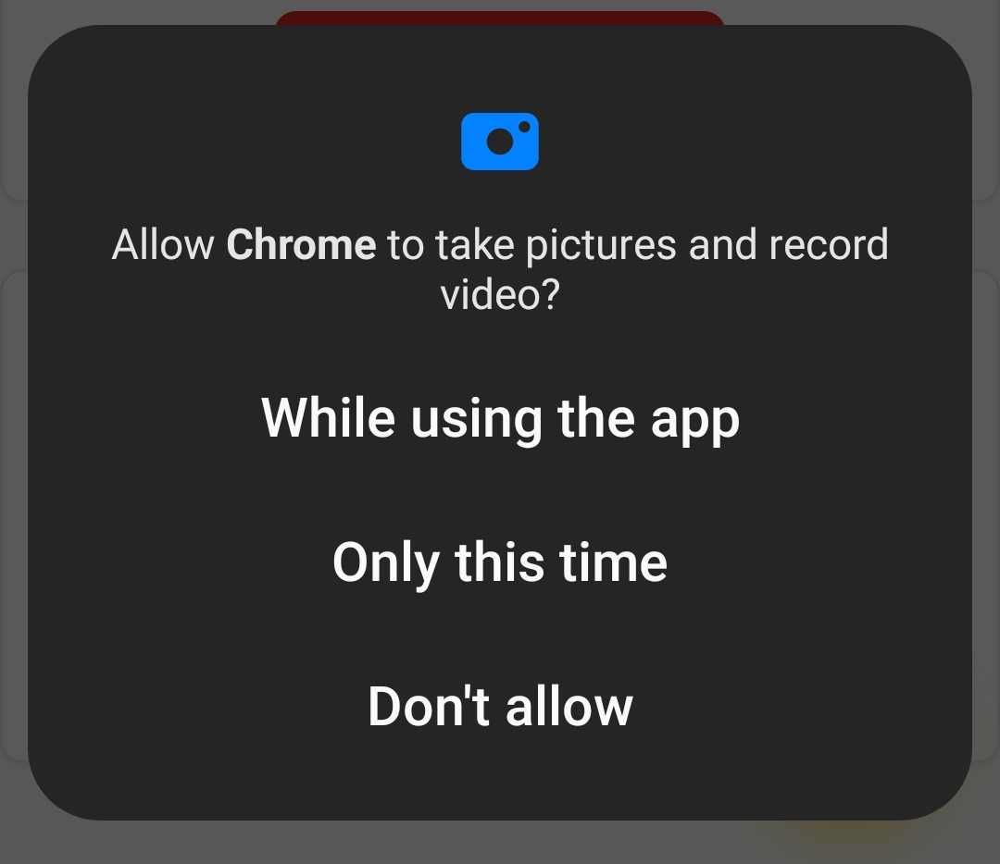
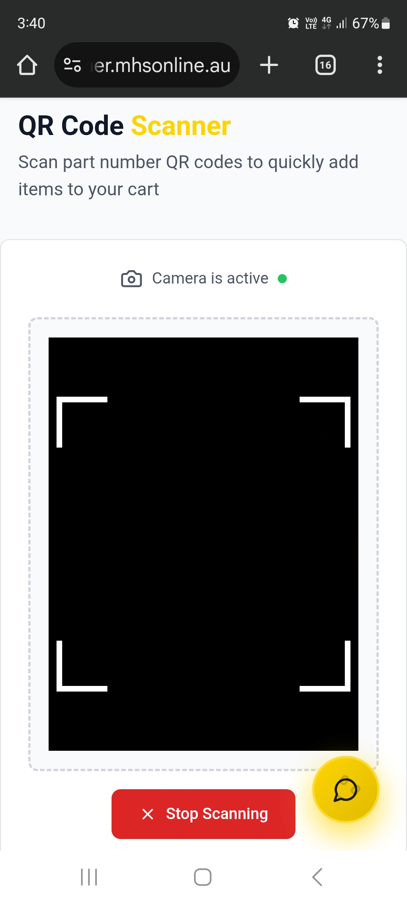

QR Code Scanning
================

The MHS Partner Portal includes built-in QR code scanning functionality, perfect for warehouse environments and quick part identification.

What is QR Scanning?
---------------------

QR code scanning allows you to:
- **Instantly search for parts** by scanning QR codes or barcodes
- **Eliminate typing errors** when searching for parts
- **Speed up the ordering process** in warehouse environments
- **Work efficiently on mobile devices**

Accessing the QR Scanner
-------------------------

.. image:: ../_static/images/QR Code Scanning/Where to access QR code scanner.jpg
   :alt: QR scanner icon in the search interface showing where to access scanning feature
   :width: 800px
   :class: screenshot

From the Main Navigation
~~~~~~~~~~~~~~~~~~~~~~~~~

1. Click "Part Enquiry" in the navigation menu
2. Look for the QR scanner icon in the search area
3. Click the scanner icon to activate the camera

From Mobile Devices
~~~~~~~~~~~~~~~~~~~~

1. Navigate to Part Enquiry on your mobile device
2. Tap the QR code icon next to the search box
3. Allow camera permissions when prompted

**Direct Access:**
- **Visit the scanner page** directly from the main menu
- **Bookmark the scanner** for quick access on mobile

Setting Up QR Scanning
-----------------------

Camera Permissions
~~~~~~~~~~~~~~~~~~

When you first use the scanner, your browser will request camera access:

1. Click "Allow" when prompted
2. Select the appropriate camera (usually back camera on mobile)
3. Ensure good lighting for best scanning results

**Mobile Setup:**
- **Add to home screen** for quick access
- **Keep the camera lens clean** for better scanning
- **Use in well-lit environments** when possible

How to Scan QR Codes
---------------------

Basic Scanning Process
~~~~~~~~~~~~~~~~~~~~~~~

1. Open the QR scanner
2. Point your camera at the QR code or barcode
3. Hold steady until the code is recognized
4. Wait for automatic search to complete

**Scanning Tips:**
- **Hold the device steady** for 2-3 seconds
- **Ensure the entire code** is visible in the frame
- **Move closer or farther** if the code isn't focusing
- **Use good lighting** for better recognition
- **Clean the camera lens** if scanning is difficult

.. image:: ../_static/images/qr-scanner-scanning-process.png
   :alt: QR scanner showing successful code recognition with part number extracted
   :width: 700px
   :class: screenshot

*Screenshot needed: QR scanner showing a QR code being successfully scanned with "Code recognized: HYD-123-456" message and automatic search starting*

**What Happens After Scanning:**
- The part number is automatically extracted
- An exact part search is performed
- Results are displayed just like a manual search
- You can immediately add items to your cart

.. image:: ../_static/images/qr-scanner-results.png
   :alt: Search results page showing part found from QR code scan
   :width: 1000px
   :class: screenshot

*Screenshot needed: Search results page showing part details after successful QR code scan, with "Scanned from QR code" indicator and part information displayed*

Supported Code Types
--------------------

The scanner recognizes:

**QR Codes:**
- Standard QR codes containing part numbers
- Data Matrix codes
- Custom QR codes with part information

**Barcodes:**
- UPC barcodes
- Code 128 barcodes
- EAN-13 barcodes
- Most common industrial barcode formats

**Part Number Formats:**
- Plain text part numbers
- JSON formatted data
- URL-encoded part information

Using QR Scanning Effectively
------------------------------

In the Warehouse
~~~~~~~~~~~~~~~~

1. Scan parts directly from shelves or bins
2. Verify part numbers before ordering
3. Check stock levels instantly
4. Add to cart for immediate ordering

For Inventory Management
~~~~~~~~~~~~~~~~~~~~~~~~~

- Scan multiple items quickly
- Build orders efficiently using mobile device
- Verify part authenticity against your records

For Reordering
~~~~~~~~~~~~~~

- Scan empty packaging to reorder parts
- Use QR codes from previous orders or invoices
- Quick lookup for maintenance schedules

Troubleshooting QR Scanning
----------------------------

**Scanner Won't Start:**
- **Check camera permissions** in browser settings
- **Refresh the page** and try again
- **Try a different browser** if issues persist
- **Ensure you're using HTTPS** (required for camera access)

**Can't Scan Codes:**
- **Clean the camera lens** 
- **Improve lighting** conditions
- **Hold device steadier**
- **Try different angles** or distances
- **Check if the code is damaged** or unclear

**Wrong Part Found:**
- **Verify the QR code** contains the correct information
- **Check for custom part number mappings**
- **Use manual search** as a backup
- **Contact support** if codes consistently fail

**Mobile-Specific Issues:**
- **Update your browser** to the latest version
- **Clear browser cache** and try again
- **Check mobile data/WiFi** connection
- **Try switching between front/back cameras**

QR Scanning Best Practices
---------------------------

**For Best Results:**
- **Use in good lighting** conditions
- **Hold the device steady** while scanning
- **Keep QR codes clean** and undamaged
- **Scan at appropriate distance** (usually 6-12 inches)

**Warehouse Efficiency:**
- **Train staff** on proper scanning techniques
- **Maintain QR code quality** on shelving and bins
- **Use mobile devices** with good cameras
- **Create standardized QR codes** for frequently ordered parts

**Security Considerations:**
- **Only scan trusted QR codes**
- **Verify part information** after scanning
- **Be cautious** with QR codes from unknown sources

Mobile Scanning Tips
---------------------

**Device Orientation:**
- **Portrait mode** usually works best
- **Landscape mode** for wide barcodes
- **Auto-rotation** can help with difficult angles

**Camera Quality:**
- **Higher resolution cameras** scan more reliably
- **Auto-focus features** improve accuracy
- **Good lighting** is more important than camera quality

**Battery Management:**
- **Camera usage** can drain battery quickly
- **Close scanner** when not in use
- **Use power-saving mode** if available

Creating QR Codes for Your Business
------------------------------------

You can create your own QR codes for frequently ordered parts:

**QR Code Content:**
- **Simple part numbers** work best
- **Avoid special characters** that might cause issues
- **Test codes** before printing in bulk

**QR Code Tools:**
- **Free online generators** are available
- **Include part number only** for simplest scanning
- **Test with the portal scanner** before deployment

**Physical Implementation:**
- **Print on durable materials** for warehouse use
- **Size appropriately** for scanning distance
- **Include human-readable text** as backup

Advanced QR Features
---------------------

Bulk Scanning Workflow
~~~~~~~~~~~~~~~~~~~~~~~

1. Scan multiple parts sequentially
2. Parts automatically added to current search session
3. Review all scanned parts before adding to cart
4. Batch process for efficiency

Integration with Favorites
~~~~~~~~~~~~~~~~~~~~~~~~~~~

- Scan parts to automatically add to favorites
- Create QR codes for your most-ordered parts
- Build custom part libraries using QR codes

Next Steps
----------

After mastering QR scanning:

1. :doc:`search-history` - Manage your search patterns and favorites
2. :doc:`advanced-search` - Explore advanced search capabilities  
3. :doc:`../ordering/adding-to-cart` - Learn to add scanned parts to your cart
4. :doc:`../advanced-features/bulk-upload` - Explore bulk ordering options
